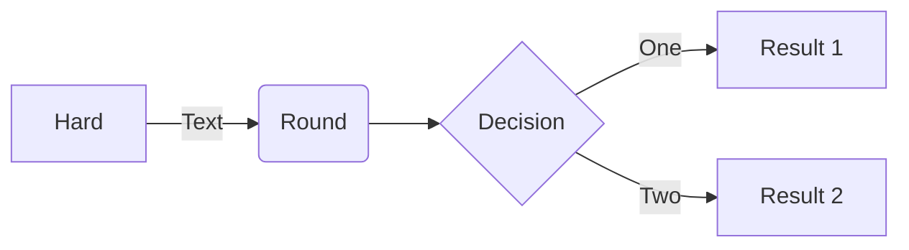

# Support natif de Mermaid

DocFX prend en charge les diagrammes au format Mermaid.

> [!NOTE]
> Mermaid diagrams is only supported in the `modern` template.

## Un exemple de diagramme de flux

## En savoir plus sur Mermaid

[Site de Mermaid](https://mermaid.js.org/)
